# Fitness Tracker
## Site Introduction
The Fitness Tracker Project is a Python-based application that allows users to log and track their workouts. Users can create an account, log their workouts (categorized as push, pull, or legs), and view their progress over time. The project utilizes Google Sheets for storing user data and workout logs, ensuring that the information is easily accessible and manageable. My inspiration for creating this program came from my own fitness journey, I personally use a fitness tracker to keep me motivated and able to see my progress.
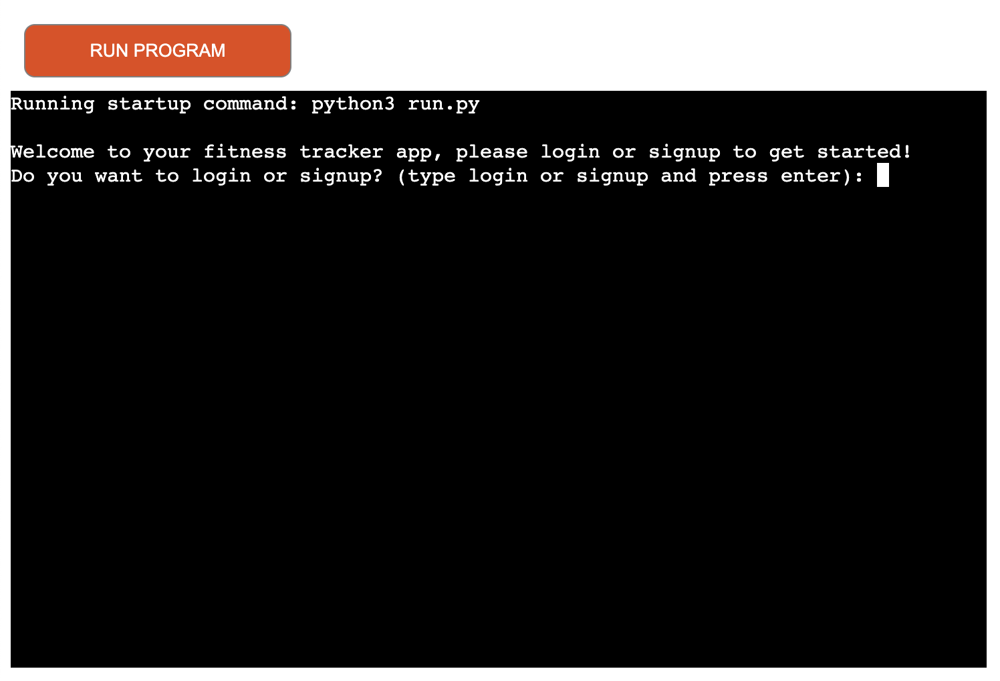

<a href="https://fitness-tracker-pp3-ac30d4f35dab.herokuapp.com/" rel="noopener">Here is the live site!</a>

## Project Planning
Prior to starting this project I had to decide what to do, I quickly decided that I wanted to do my project on something that is a big part of my life and that I have a passion for, I have recently undergone a big change in the fitness in my own life and thought that I could use this to create a program for logging workouts and tracking progress. I decided the best way to plan out my code was to create a flow chart, personally I just used the old fashion method of pencil and paper but in future I will plan to use lucid charts. My flow chart allowed me to tackle each small part of my code without getting side tracked and feeling overwhelmed.

## User Experience (UX)
### Program Goals
- Allow user to signup if they have not already, requires username and password.
- Allow user to login if they have already signed up user their username and password.
- Allow the user to log a workout and store it in the google sheet that is connected using API's
- Allow the user to view previous workout data that they have entered
- Allow the user to clearly and easily navigate the program at each stage so that there is always a valid entry into the console
- Have a response to every single input option at each stage of the program so that the user is never stuck or unsure on what the program needs them to input to carry on using the program
- Allow the user to logout/exit the program once they are finished using it

### User Needs
- As a user of this programme I want to be able to log my workouts and store the amount of weight, sets and reps I do for each exercise.
- As a user I want to be able to view the previous workout that I have logged to check my previous weight, sets and reps to challenge myself to do more during the next workout.
- As a user I want to be able to receive clear instructions if I input invalid data so that I clearly understand what data is required to be input.
- As a user I want to recieve confirmation of each input, for example when I signup I want to have confirmation that it has been succesfull, or when I login I want to visually see that the login is successful.
- As a user I want the workouts that I have logged to be clearly displayed when I want to view them.

### Program Flow
- When the user first enters into the program they are presented with a screen that explains a little bit about what the program can be used for and prompts the user to either select to signup or login

- If the user has selected to signup they will be used to enter a username for their account, after a username has been entered then the user will be asked to enter a password. Once the user has entered this data it will be stored in the worksheet that is linked to the program using googlesheets API's.
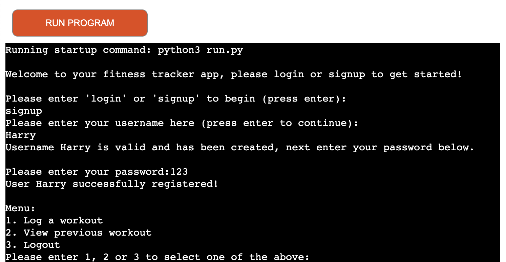
- If the user has selected to login as they have already created an account they will need to enter their username, the program will then check that it has that username (case sensitive) stored in the worksheet attached to the program, if the username matches one stored then the user will need to input the valid password attached to that username, if the user does not input a username that matches one stored in the worksheet then the program will tell the user that the username entered does not exist and will redirect them to signup or login again.
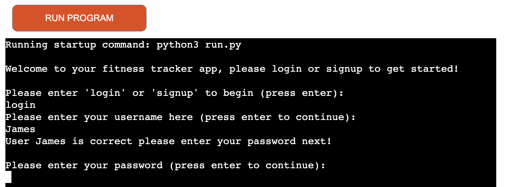
  - Invalid username example below
  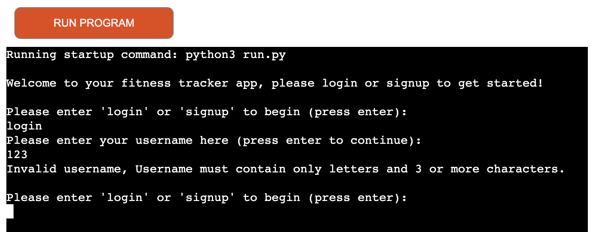
- Once the user is logged in the console will tell the user that they have successfully logged in, it will then load a main menu which displays 3 options. The options are to log a workout, view a previous workout or logout. The user must input 1,2 or 3 to select which one they would like to continue with.
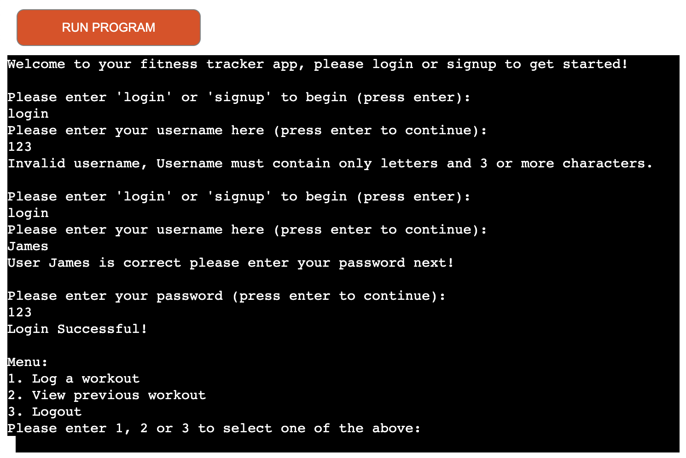
- If the user selects option 1 to log a workout then they will go through to the next menu where they can then select which workout type they want to log 1 Push, 2 Pull or 3 Legs. Once the user has selected a workout type to log then the program will begin to loop through 5 different exercises to log, each exercise requires the user to input weight, sets and reps. The workout data entered will then be stored in the worksheet in the same row as the users username and password, this is stored in this way so that when the user wants to view their previous workout the program will check what user is logged in and retrieve the workout data that is assigned to those login details.
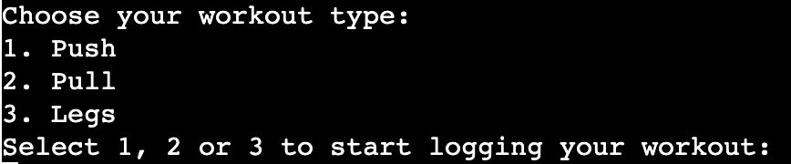
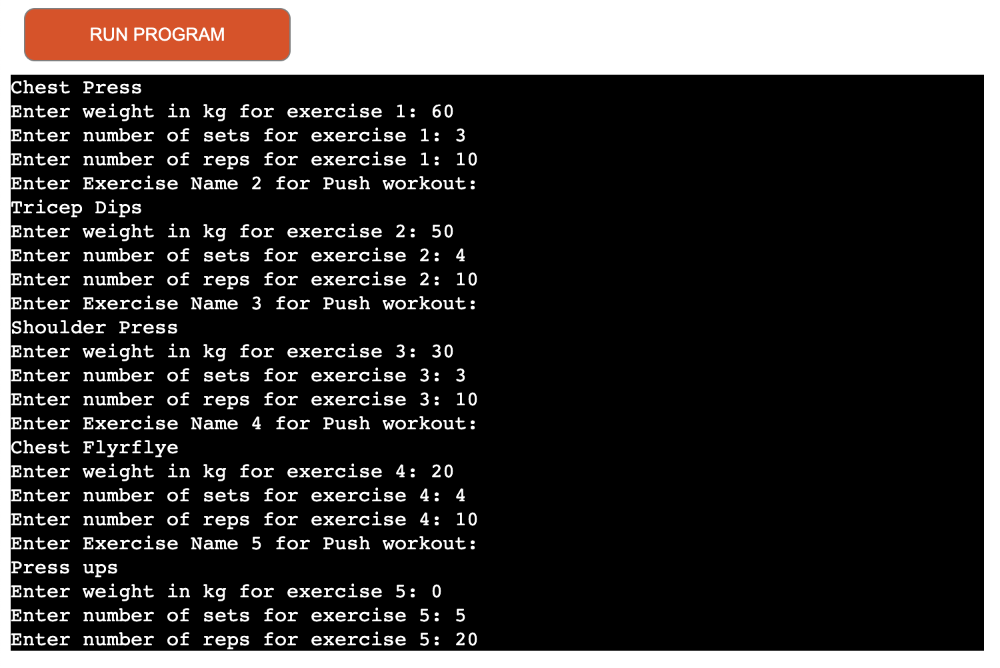
- If the user selects option 2 view a previous workout and the user has previous workout data then the program will retrieve the data by validating the correct username and password matches the one that was used to login and puts this data into a table so that it can be viewed clearly in the console. I have imported tabulate to be able to convert the worksheet data into a table which is printed into the console as the data is not stored in the same format in the worksheet.
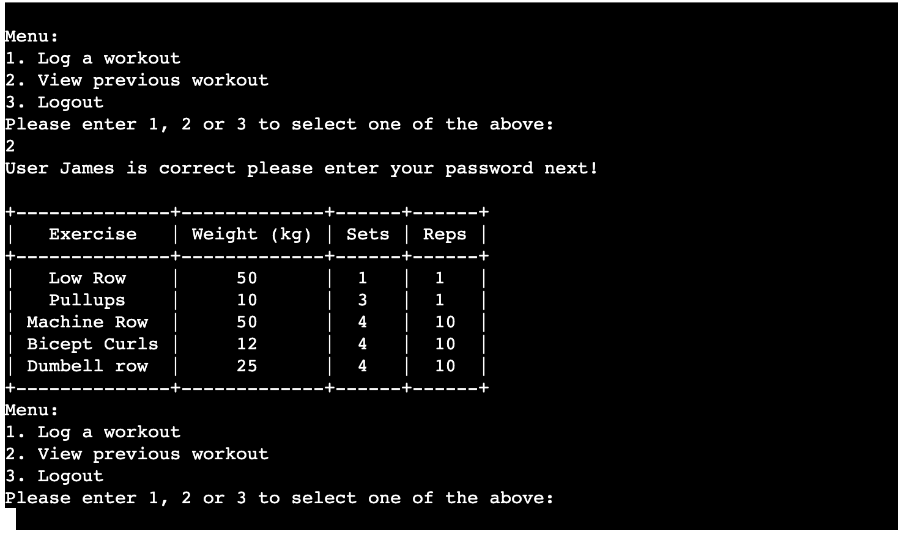
- If the user selects option 3 to logout then the user will be logged out and the program will exit and stop running. The user will then be told that they have successfully been logged out. It will also prompt them to remember to come back and log their next workout to try and keep them motivated to keep coming back and working out.
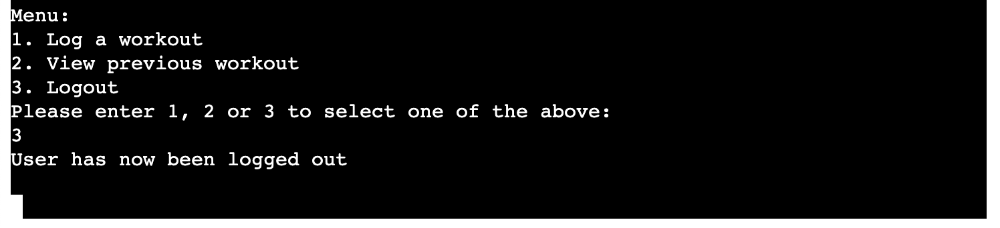

## Testing
| What I am testing? | How I tested it| Expected Outcome | Result |
| -- | -- | -- | -- |
| Welcome message appears | Run the program and check if print statement prints to console | Welcome message shows when the program is run | Pass |
| Login/Signup selection works | Type 'login' and 'signup' into the console | Program loads 'login' or 'signup' when either one is selected | Pass |
| Username validation | Enter a username that is less than 4 characters and contains numbers | Console tells me I have entered an invalid username and must contain only letters and be more than 3 characters | Pass |
| If there is a username already in use | I signed up using a username, then tried to signup again using the same username | Console to exit the signup process and print to user that username already exists and prompt to signup again or login | Pass |
| Error messages work | Enter an invalid number when selecting a workout, enter '4' which is not an option | Error message suggesting the user needs to enter 1,2 or 3 to select a workout type | Pass |

### Pep8 CI Python Code Validation
- I have entered my code into the pep8 CI python code validation to check for any invalid code or indentantion in my code, there were some indentation errors and areas that needed adjusting to be valid. I fixed these errors in the validation checker and copied the new valid code back to my workspace.
- I am recieving errors for code lines being too long, this is not because of invalid code but due to how the CI template is setup, this just means that those lines will read over 2 rows in the deployed terminal.
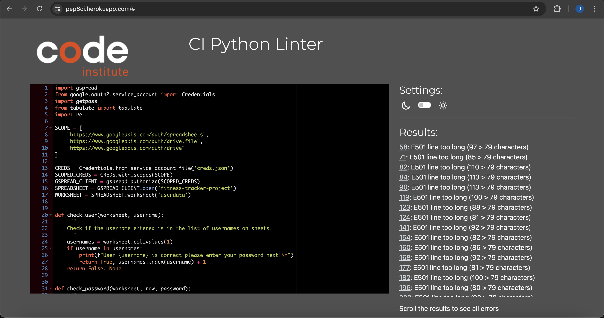
## Bugs and Fixes
### Identified bug where workout data always overrides the previous workout data instead of storing extra
- I have been unable to fix this bug due to the chosen layout and append statments I have used to create my program, despite this bug the program still works and functions showcasing my Python skills. If I were to improve this program to make it more in depth and have a better usablility then I would set it up so that each user that signs up has a new sheet created which stores every single workout logged and allows the user to see a workout by selecting a certain date, it would then pull the data stored on that day and display it.

### Identified a bug where everytime a user logged a workout it would create a whole new row for username and that specific workout
- After identifying this bug I was able to create the function which checks if the user has already got workout data stored or if their username is in the worksheet, if the username is there it will then remove and update the workout data into the row where the username and password is stored. The worksheet will only ever have 1 row for each new user instead of before each workout would create a duplicate user with the same password and username.

### Identified a bug with my validation functions
- After adding valdation functions to my log_workouts section I wanted to be able to check the user has inputted an exercise name which contains only letters and more than 3 characters, after testing this in the terminal initially I was getting my error message when entering "Chest Press" which I want to be a valid entry, I then realised that the console was only giving a valid entry when I entered in a word with exactly 4 letters example 'push'.
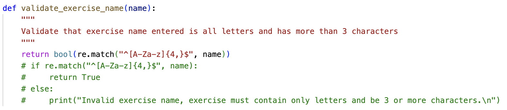
- To fix this I had to allow the validation to pass as True even if there is a space in the exercise name. 
- Here is the code I changed to fix this bug
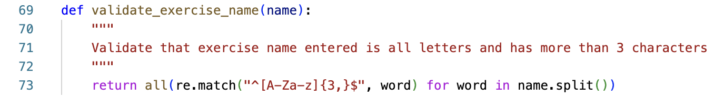

### Identified a bug once the project was deployed where workout data was not being stored
- This error was occuring due to incorrect indentation in my code, the code was simply not being run properly due to being indented too much after identifying this issue in the log_workout function I was then able to test that it was working again bu viewing the previous workout, logging a new workout and ensuring that the new workout when called by the view previous workout function showed the new inputted data.
- Image to show the data that should have been logged and shown in the view previous workout table

- The response to calling the view previous workout data before fixing the bug
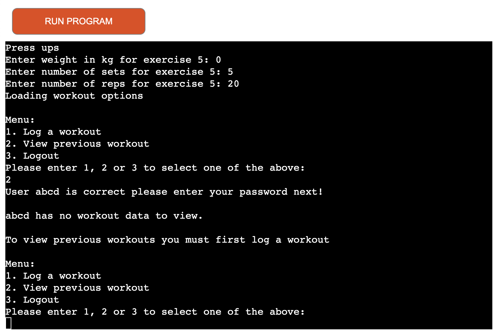

### Unfixed bugs
- There are some unfixed bugs where statements are printed where they should not be for example after logging a valid exercise the console, it is printing that the workout has been logged successfully which should only be shown upon submitting the final exercise
### Deployment
These are the steps I followed to deploy my live program terminal
- Firstly I had to type 'pip3 freeze > requirements.txt' into the terminal in my code space to add the requirements for Heroku to download to run my program so that it works.
- Next I went onto the Heroku website, went to my dashboard and selected 'Create New App' from the 'New' dropdown menu in the top right.
- I then named my app and selected 'create new app' to continue, I then selected the settings tab
- Once in the settings tab I created my config var for the creds.json file so that the heroku app is able to access my google sheet that is linked to this project, without this my project would not function correctly.
- I then added 2 build packs, python first and then node.js second to allow the mock terminal to run that is provided by Code Institute for this project.
- Next I selected the deploy tab, I then linked my github profile and searched for my project repository and linked it ready for deployment.
- Finally I opted to have automatic deploys so that my live program updates each time I push my code to github. I then clicked deploy branch to get my live site.

Here is the link to my live site: https://fitness-tracker-pp3-ac30d4f35dab.herokuapp.com/

## Future Enhancements
- In the future if I were to develop this project further then here are some of the few things that I would impliment straight away:
  - One of the first things that I would do is set up my worksheet and code to create a new sheet when a new user signs up so that each user has a whole sheet to store their workout data. This will improve the program as the user will then be able to retrieve any workout that they have logged.
  - I would also store the date that the specific workout was done on so that the user can enter the date to retrieve that specific workout.
  - I could also add a function that takes the first input weight of a certain exercise and allows the user to compare their most recent weight with the first input to see their progress.

## Credits and Resources Used
- I have used various W3 schools to check python structure and help get the base format for my code
- I have used various youtube videos to help understand functions
- I have also used the love sandwiches CI walkthrough project to help me link my google sheet using API's and at various points during coding my project to help understand how to call my functions.
- I have also spoken with fellow students to get a 4 eyes check when I was struggling to get some code to work, this helped notice any typos or missing colons etc that I may have missed.

